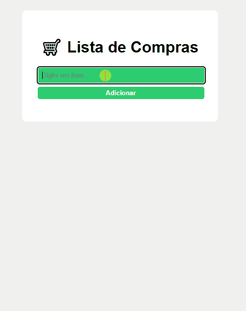

# 🛒 Lista de Compras

Um projeto simples de Front-end para treinar HTML, CSS e JavaScript.
O usuário pode adicionar itens a uma lista de compras digitando no campo de texto e clicando no botão Adicionar.
A lista é exibida dinamicamente na tela.

//

### 🚀 Tecnologias Utilizadas
	•	HTML5 → Estrutura do projeto
	•	CSS3 → Estilização da interface
	•	JavaScript (DOM Manipulation) → Lógica de adicionar itens à lista

.
### 📌 Funcionalidades

✅ Adicionar itens à lista de compras

✅ Exibição dinâmica dos itens na tela

✅ Design responsivo inspirado em VS Code (dark mode)

✅ Função para remover itens da lista

✅ Armazenamento dos itens no LocalStorage

...
### 🗂 Estrutura de Pastas

/lista-de-compras

│── index.html

│── style.css

│── script.js

└── README.md

....
### 🧑‍💻 Como Usar
	1.	Clone este repositório:
git clone https://github.com/seu-usuario/lista-de-compras.git

2.	Abra o arquivo index.html no navegador.
	3.	Digite um item no campo de texto e clique em Adicionar.

.....

### 🎯 Objetivo

Este projeto foi criado com o objetivo de praticar lógica de programação e manipulação do DOM, servindo como base para projetos mais avançados.